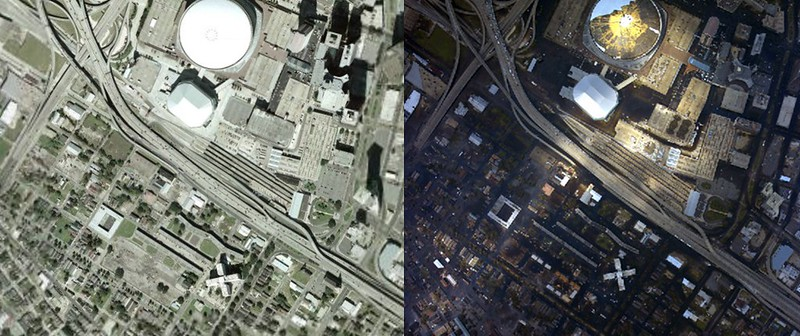

Flooding and Environmental Disparity in New Orleans
===================================================

Geographical History of New Orleans
~~~~~~~~~~~~~~~~~~~~~~~~~~~~~~~~~~~
New Orleans is surrounded by water, specifically by the Mississippi River, Lake Pontchartrain, Lake Borgne and other swamplands. On top of this, New Orleans averages 6 feet below sea level, increasing its risk for flooding. Thus, the United States Army Corps of Engineers built levees and seawalls throughout the city. A levee is compacted soil that resembles a pyramid shape, which helps combat flooding from storms and the Mississippi river in New Orleans. Flood walls are often concrete barriers with steel beams within them, but can also be vertical walls of sand bags. During Hurricane Katrina these flooding supports were breached, and since then they have only been enhanced by the United States Army Corps of Engineers, as their importance is obvious now. A map of the current levees and floodwalls can be seen below.

One thing to be aware of with the levee situation in New Orleans, is the fact that some of the levees around the city were blown with dynamite during the flood of 1927 (American Experience). This caused major flooding of the Lower Ninth ward. Many of the people who lived there were low income Black citizens. In 1965 hurricane Betsy also flooded the Lower Ninth Ward. The levees protecting this area were suspected by its residents to have been blown up to protect the wealthier neighborhoods yet again. When Hurricane Katrina occurred in 2005, similar suspicions arose again. These suspicions were not proven to have supporting evidence and therefore were concluded to be false. (Myers, 2005)

Overview of Flooding
~~~~~~~~~~~~~~~~~~~~~
1.5 million people evacuated before the storm, however, more than 100,000 stayed behind in New Orleans. This left many people defenseless, especially after the levees broke. It was reported that about 1,071 people died just in Louisiana (Manuel, 2006, pp. A32-A39). The public eye criticized how long the active-duty military services took, five days to be precise. There were many reasons for their delay, political and institutional. However, numerous federal, state, and local agencies jumped into action to rescue those that were left stranded. It was reported that the Coast Guard helicopters hoisted more than 4,700 people in the first seven days and Coast guard surface resources (mostly small boats) rescued more than 11,500 people (Morris, 2007, pp. 94-109).

.. panels::

    .. image:: an-aerial-view-showing-a-small-portion-of-the-flooding-and-destruction-after-de223d.jpg

    ++++++++++++++


    ---

    .. image:: an-aerial-view-showing-flooding-and-damage-at-a-levee-break-in-new-orleans-2f3465.jpg

    ++++++++++++++

    ---

    .. image:: 139032153_adaa339563_w.jpg

    ++++++++++++++


    ---

    .. image:: 4920603356_86b4afe467_w.jpg

    ++++++++++++++


Coastal Guard
~~~~~~~~~~~~~~
The Coast Guard was a beam of hope during the catastrophe for the New Orleans citizens. Compared to the military, the Coast guard was first to the scene to search and rescue. Their success was marked by their effective coordination. They had been trained for this kind of catastrophe, having practiced daily search and rescue missions, waterway security, and navigational aids repair (Morris, 2007, pp. 94-109). It was nothing out of the ordinary for them, it was more of the scale of the event that was extraordinary. Having to switch to helicopter duty was an easy transition for the Coast Guard due to the fact that each had received the same training. Their flexibility to respond allowed the Coast Guard to save many lives and minimize the casualties of Hurricane Katrina.

.. panels::

    .. image:: hurricane-katrina-new-orleans-la-august-31-2005-evacuees-arrive-and-are-unloaded-2a0801.jpg

    ++++++++++++++


    ---

    .. image:: hurricane-katrina-new-orleans-la-september-6-2005-fema-urban-search-and-rescue-4f93a7.jpg

    ++++++++++++++

Mapping Levee Failure During Hurricane Katrina
~~~~~~~~~~~~~~~~~~~~~~~~~~~~~~~~~~~~~~~~~~~~~~~
.. raw:: html
   :file: LeveeMap.html
   
The Superdome
~~~~~~~~~~~~~~

About the Superdome
````````````````````
The Superdome was a spectacle for the American audience watching from their television, safe from Hurricane Katrina. As many journalists liked to label it, it was a bacterial soup bowl (Cosh, 2004-5). Many of the people who evacuated to the Superdome were elderly people, mothers and their children, tourists, and people who could not leave due to financial reasons. In total, about 25,000 people were trapped in the New Orleans Superdome (Hamilton, 2006).

Experience in the Superdome
````````````````````````````
Harris was a former San Diego County probation officer on vacation when the storm hit on August 29, 2005. He recounts the “stench of backed-up, children sleeping on cardboard soaked with urine and feces, 90-degree heat and oppressive humidity after part of the roof blew off and the electricity failed (Murphy, 2010).” In the dome, six people died there. One man committed suicide by jumping from an upper seat area, one due to a drug overdose, and four died of natural causes. The medical team described the experience as something that “will haunt you for the rest of your life (EMSWorld.com,).” Supplies and labor were short, as the evacuees came by thousands compared to the medical providers that were fewer than 10. However, the medical team praised the evacuees for their behavior during those stressful times. Brown, one of the medical crew stated: "If 99 people were behaving and one was not, the TV cameras were on the one who wasn't...As a result, the people who were courageous, wonderful citizens were mislabeled because of the few (EMSWorld.com, 2015)."


From the Outside View
```````````````````````




Flooding in Black Communities
~~~~~~~~~~~~~~~~~~~~~~~~~~~~~~

New Orleans has a rich black history and culture that emanates throughout the city.  Once a French colony, the slaves that were brought to New Orleans were often from the same area of Africa, and many families were enslaved together instead of being separated when captured. The French instated the Code Noir, a set of laws that governed the slaves, and while they were still cruel and inhumane, they did state that slaves should not work on Sundays. This day of rest allowed the African slaves to keep their culture alive, often gathering at the Congo Square to dance and sell goods for money on the side. This preservation of African culture ensured that New Orleans black history would run deep and strong even until the modern day.

However, just because their culture was preserved through their enslavement to some degree does not mean that Black citizens held any of the same rights as white citizens. In New Orleans, Blacks struggled to buy land due to redlining. The areas that were not as desirable to Whites were open for Blacks to purchase land. These areas included the Lower Ninth Ward, Pontchartrain Park, and New Orleans East which are the areas with lower overall sea level and a higher likelihood of flooding (United Teachers of New Orleans, 2021). According to Thomas Frank in his article, flooding disproportionately impacts Black urban neighborhoods. This can clearly be seen in the maps below depicting when Hurricane Katrina hit.

.. panels::

    .. image:: 325861311_fafb6941f1_w.jpg

    ++++++++++++++


    ---

    .. image:: 325910104_bd06ac5683_w.jpg

    ++++++++++++++

    ---

    .. image:: 4927464290_c8b1eea50a_w.jpg

    ++++++++++++++
